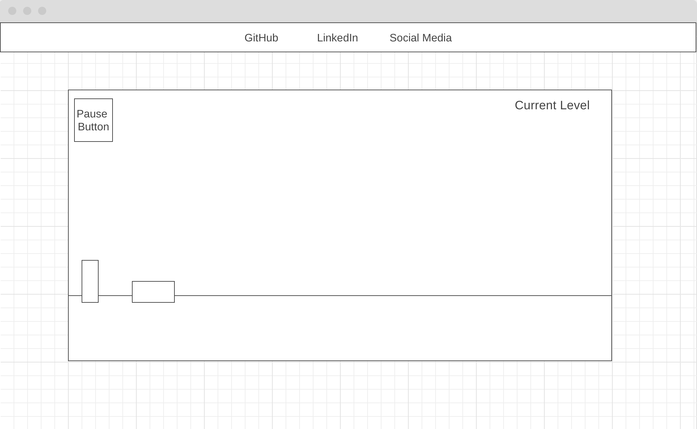
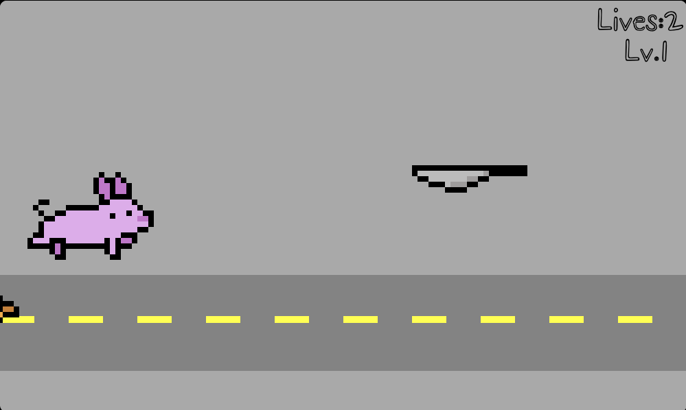

# Bringing Home the Bacon

## Background:
Bringing Home the Bacon is a sidescroller game borne of my love for the genre when growing up with series such as Mario and Sonic the Hedgehog. In this game, the player will take control of the pig as it tries to escape the angry butcher, all while avoiding obstacles along the way. The game consists of levels that should be progressively more and more challenging and will introduce more and more obstacles along the way.

In order to best proceed, the game will require pattern recognition and good reaction time from the player. The rules are simple:

1) The player has 3 lives to get as far as they can within the game
2) If the pig is hit by an obstacle, the player loses a life
3) If the player loses all their lives before completing the game, the butcher wins!
4) If the player clears all the current levels, they successfully brought home the bacon!

Live [here](https://ggharsha.github.io/bringing_home_the_bacon/)

## Functionality and MVPs:
In Bringing Home the Bacon, users will be able to:
* Start the game
* Control the pig using keys <W/D>, <Up/Down>, or <Space/Down>
* Progress through levels by reaching the end of each stage
* Restart the game upon losing all lives or finishing the game

In addition, this project will include:
* Instructions on how to control the pig
* A production README

## Wireframes:

* The navbar at the top of the window will contain links to the project GitHub repo, my LinkedIn, and my website/social media
* The main game will take up most of the window and will contain other sub-elements
* The pig and butcher will be at fixed horizontal positions on the screen, though the pig can move vertically depending on obstacles
* The pause button will be located in the top left of the page, and when clicked, it will create a clickable menu that appears in the middle of the screen
* The menu in the middle of the screen will contain a button that leads to instructions, a button that resumes the game, and a button that restarts the game
* The top right will contain the current level

## Libraries and APIs:
This project will be implemented with the following technologies:
* HTML/CSS
* Vanilla JavaScript
* Canvas API to render the background and characters on the screen
* Webpack to compile JavaScript modules

## Implementation Timeline:
* 12/31 Thursday
    * Implement basic structure with classes for the game
    * Get canvas to display on page along with pig

* 1/3 Monday
    * Flesh out classes and finalize all obstacles and characters
    * Add game-state logic for lives

* 1/4 Tuesday
    * Finish implementing logic for collision detection, movement, and screen-scrolling

* 1/5 Wednesday
    * Finish HTML and CSS to polish project including a navbar

* 1/6 Thursday
    * Catch bugs and fix animation stuttering

## Bonus Features:
This project has abundant potential in terms of add-on features. Some ideas include:
* Introducing new levels and obstacles that add even more difficulty levels to the game.
* Introducing skin packs to change some of the characters in the game (pig, butcher, obstacle sprites). Potentially making themes based on holidays.
* Introducing a challenge mode where the player only has a single life to get through as many levels as possible.
* Adding a scoreboard ranking system that lists the top players based on how deep they manage to proceed.
* Introducing a skip-level system that generates a code every 10 levels. If the user inputs the code, they can skip to level 10/20/etc so that not all progress is lost in a deep run. This idea is reserved for when the game has enough levels for this feature to make sense. Runs using this feature would not be counted towards a potential scoreboard.
